# ClearPipe execution plan

## Purpose

This directory decomposes the consolidated ClearPipe specification into **32 independently assignable Markdown task packets**. Each packet has one primary outcome, bounded scope, explicit dependencies, parallel peers, handoff contracts, acceptance criteria, verification, and guardrails.

The uploaded source contains an earlier specification followed by a consolidated replacement. This plan treats the later consolidated version as authoritative and retains stricter, non-conflicting requirements from the earlier version. Actual repository paths, route names, APIs, and supported backend behavior are deliberately established by the discovery tasks rather than guessed here.

## Planning rules

- **One product and one runtime:** ClearPipe is the visual authoring layer; existing ClearML pipeline services remain the persistence and execution boundary.
- **One shared model:** task-backed and function-backed authoring extend one canonical, versioned graph model.
- **Contract-first parallelism:** discovery converges once in CP-05; graph, backend, UX, and test contracts then fan out.
- **Relative sizing:** every implementation packet is either 5 or 8 complexity points. These are planning weights, not calendar estimates.
- **Single ownership:** each packet has one directly responsible owner even when reviewers or specialists contribute.
- **Evidence gates:** CP-05, CP-28/CP-29, and CP-32 are convergence gates. They should not be bypassed to increase apparent parallelism.
- **No speculative architecture:** when the current repository or backend cannot support an ideal interaction, implement only verified behavior and expose the limitation honestly.

## Execution model

```mermaid
flowchart LR
    W0["Wave 0<br/>Parallel discovery"] --> W1["Wave 1<br/>Architecture gate"]
    W1 --> W2["Wave 2<br/>Parallel contracts"]
    W2 --> W3["Wave 3<br/>Parallel foundations"]
    W3 --> W4["Wave 4<br/>Editor/lifecycle foundation"]
    W4 --> W5["Wave 5<br/>Semantic surfaces"]
    W5 --> W6["Wave 6<br/>Feature completion"]
    W6 --> W7["Wave 7<br/>Integration convergence"]
    W7 --> W8["Wave 8<br/>Hardening + regression"]
    W8 --> W9["Wave 9<br/>Final release gate"]
```

A wave is a scheduling aid, not a blanket barrier. A task may start as soon as **its own hard dependencies** are complete, even if an unrelated task in the prior wave is still open. Conversely, a task must not start merely because its wave number is current if one of its dependencies is unfinished.

## Wave plan

| Wave | Name | Task packets | Maximum parallel owners | Total points | Parallel/sequential rule | Exit condition |
|---:|---|---|---:|---:|---|---|
| 0 | Parallel discovery | [CP-01](./cp_01_discover-pipelines-architecture.md), [CP-02](./cp_02_audit-current-clearpipe.md), [CP-03](./cp_03_analyze-clearml-pipeline-semantics.md), [CP-04](./cp_04_analyze-reference-ux.md) | 4 | 20 | CP-01–CP-04 run concurrently; each studies a different source of truth. | All four evidence packs are complete; no implementation assumptions remain hidden. |
| 1 | Architecture convergence gate | [CP-05](./cp_05_architecture-decision-record.md) | 1 | 5 | CP-05 is sequential because it resolves conflicts and freezes shared decisions. | The ADR, parity matrix, ownership boundaries, and ordered milestones are approved. |
| 2 | Parallel contract definition | [CP-06](./cp_06_canonical-graph-schema.md), [CP-07](./cp_07_backend-integration-contracts.md), [CP-08](./cp_08_ux-architecture-contract.md), [CP-09](./cp_09_test-architecture-harness.md) | 4 | 23 | CP-06–CP-09 run concurrently after CP-05, with short contract reviews before merge. | Graph, backend, UX, and test contracts are stable enough for independent implementation. |
| 3 | Parallel foundational implementation | [CP-10](./cp_10_graph-state-engine.md), [CP-11](./cp_11_validation-engine.md), [CP-12](./cp_12_task-code-generator.md), [CP-13](./cp_13_function-code-generator.md), [CP-14](./cp_14_service-adapters-route-integration.md), [CP-15](./cp_15_workspace-shell-first-use.md) | 6 | 39 | CP-10–CP-15 run concurrently against Wave 2 interfaces; avoid cross-owning core files. | Core domain engines, adapters, generators, and shell compile behind stable contracts. |
| 4 | Parallel editor and lifecycle foundation | [CP-16](./cp_16_canvas-foundation.md), [CP-17](./cp_17_generic-node-ui-framework.md), [CP-18](./cp_18_shared-resource-query-layer.md), [CP-19](./cp_19_persistence-lifecycle.md) | 4 | 29 | CP-16–CP-19 run concurrently; coordinate through graph, adapter, and shell extension points. | A usable editor foundation and real save/reload lifecycle exist. |
| 5 | Parallel semantic and lifecycle surfaces | [CP-20](./cp_20_port-edge-semantics.md), [CP-21](./cp_21_dataset-browser-integration.md), [CP-22](./cp_22_import-export-unsaved-guards.md), [CP-23](./cp_23_toolbar-code-preview.md) | 4 | 20 | CP-20–CP-23 run concurrently once editor foundations exist. | Semantic connections, datasets, interchange, toolbar, and preview are integrated. |
| 6 | Parallel feature completion | [CP-24](./cp_24_task-backed-authoring.md), [CP-25](./cp_25_code-backed-authoring.md), [CP-26](./cp_26_execution-integration.md), [CP-27](./cp_27_advanced-editor-operations.md) | 4 | 32 | CP-24–CP-27 run concurrently; task/code nodes extend shared frameworks rather than forking them. | Both authoring modes, execution feedback, and advanced editing are feature-complete for the supported subset. |
| 7 | Integration convergence | [CP-28](./cp_28_complete-task-vertical-slice.md), [CP-29](./cp_29_edit-existing-pipelines.md) | 2 | 13 | CP-28 and CP-29 can run concurrently after their dependencies, but both are convergence tasks. | The complete task-backed slice passes and supported existing pipelines round-trip safely. |
| 8 | Parallel hardening and regression coverage | [CP-30](./cp_30_accessibility-responsive-performance.md), [CP-31](./cp_31_automated-coverage-regression.md) | 2 | 16 | CP-30 and CP-31 run concurrently and feed fixes back to owning modules. | Accessibility, responsive/performance hardening, full coverage, and `/pipelines` regressions are closed. |
| 9 | Final release-quality gate | [CP-32](./cp_32_final-integration-quality-report.md) | 1 | 5 | CP-32 is sequential and closes only after all release prerequisites are complete. | All repository checks and manual acceptance journeys pass; the final report is evidence-based. |

## What must run in sequence

1. **Discovery before architecture:** CP-01 through CP-04 run in parallel, but CP-05 waits for all four. The ADR must reconcile application architecture, current WIP, ClearML semantics, and the functional reference.
2. **Architecture before shared contracts:** CP-06 through CP-09 depend on CP-05. They may run in parallel only after ownership boundaries and product decisions are explicit.
3. **Contracts before implementations that consume them:** graph state, validation, generators, adapters, and shell work must use the approved Wave 2 interfaces rather than defining local alternatives.
4. **Foundations before domain features:** task/code authoring, execution, and advanced editing depend on the shared editor, graph, semantic-edge, lifecycle, and service foundations.
5. **Complete slice before release hardening:** CP-28 proves a real task-backed end-to-end workflow. CP-29 proves safe existing-pipeline editing and read-only fallbacks.
6. **Hardening and regression before final reporting:** CP-30 and CP-31 run in parallel, then CP-32 executes the definitive quality gate and report.

## What can run in parallel

- **Wave 0:** four independent discovery tracks.
- **Wave 2:** graph contract, backend contract, UX contract, and test contract.
- **Wave 3:** state engine, validator, two generators, service adapters, and editor shell.
- **Wave 4:** canvas, generic node framework, resource selectors, and lifecycle.
- **Wave 5:** semantic edges, dataset integration, import/export/guards, and toolbar/code preview.
- **Wave 6:** task-backed authoring, code-backed authoring, execution integration, and advanced editing.
- **Wave 7:** the task vertical slice and existing-pipeline editing can converge concurrently once their own dependencies are ready.
- **Wave 8:** accessibility/responsive/performance hardening and comprehensive regression coverage.

The graph supports up to six simultaneous owners in Wave 3. With a smaller team, pull ready work in critical-path order and keep the same dependency rules.

## Critical path

One longest path by relative complexity is:

**[CP-04](./cp_04_analyze-reference-ux.md) → [CP-05](./cp_05_architecture-decision-record.md) → [CP-06](./cp_06_canonical-graph-schema.md) → [CP-10](./cp_10_graph-state-engine.md) → [CP-17](./cp_17_generic-node-ui-framework.md) → [CP-20](./cp_20_port-edge-semantics.md) → [CP-25](./cp_25_code-backed-authoring.md) → [CP-29](./cp_29_edit-existing-pipelines.md) → [CP-31](./cp_31_automated-coverage-regression.md) → [CP-32](./cp_32_final-integration-quality-report.md)**

Several discovery and contract branches tie near the beginning, so this should be treated as a prioritization guide rather than a duration forecast. CP-28 and CP-30 remain mandatory release prerequisites even though they are not on this particular weighted path.

## Shared-contract ownership

| Contract or shared area | Owning packet | Consumers must do |
|---|---|---|
| Architecture decisions and product boundary | CP-05 | Reference the ADR; do not reopen settled choices inside feature code. |
| Graph schema, stable IDs, ports, edges, migrations | CP-06 | Extend through typed discriminators and migration rules. |
| Graph commands, history primitives, dirty semantics | CP-10 | Dispatch commands; do not mutate canvas/domain state directly. |
| Diagnostics and preflight | CP-11 | Emit stable diagnostic codes through the validator contract. |
| Task-backed generation | CP-12 | Register task nodes through the generator interface. |
| Function/component generation | CP-13 | Register code nodes through the generator interface. |
| Pipeline services, permissions, flags, routes | CP-14 | Use adapters; do not duplicate clients or route strings. |
| Workspace shell and panel behavior | CP-15 | Mount features through defined slots/regions. |
| Generic node rendering and inspector framework | CP-17 | Add node-type extensions rather than fork cards or forms. |
| Lifecycle and unsaved state | CP-19 | Use one persisted identity and one dirty-state source. |
| Semantic connection rules | CP-20 | Declare port compatibility; do not infer meaning from visual edges. |
| Test harness and fixture policy | CP-09 | Add coverage at the narrowest stable layer and reuse fixtures. |

## Merge and coordination rules

1. Merge contract tasks before broad downstream implementation, or publish an explicitly versioned branch/interface if repository policy supports stacked work.
2. Assign one owner per shared contract file. Feature owners add registrations and adapters in separate modules wherever possible.
3. A breaking change to CP-06, CP-10, CP-11, CP-12, CP-13, CP-14, CP-15, CP-17, CP-19, or CP-20 requires notifying all direct consumers and updating fixtures in the same change.
4. Integration tasks fix defects in the owning module; they do not accumulate shadow implementations.
5. Test doubles may isolate external boundaries, but no production flow may rely on mock data, browser-only persistence, simulated execution, or fabricated statuses.
6. Every task records exact repository commands and results so CP-32 can report only checks that actually ran.

## Task manifest

| Task | Outcome | Lane | Wave | Points | Hard dependencies | Directly blocks |
|---|---|---|---:|---:|---|---|
| [CP-01](./cp_01_discover-pipelines-architecture.md) | Discover the existing `/pipelines` architecture end to end | Discovery | 0 | 5 | None | CP-05, CP-07, CP-09 |
| [CP-02](./cp_02_audit-current-clearpipe.md) | Audit the current `/clearpipe` work in progress | Discovery | 0 | 5 | None | CP-05, CP-08, CP-09 |
| [CP-03](./cp_03_analyze-clearml-pipeline-semantics.md) | Map ClearML pipeline semantics and select the code-generation model | Discovery | 0 | 5 | None | CP-05, CP-06, CP-12, CP-13 |
| [CP-04](./cp_04_analyze-reference-ux.md) | Analyze the ClearPipe functional and visual reference | Discovery | 0 | 5 | None | CP-05, CP-08 |
| [CP-05](./cp_05_architecture-decision-record.md) | Synthesize the architecture decision record and functional parity matrix | Architecture gate | 1 | 5 | CP-01, CP-02, CP-03, CP-04 | CP-06, CP-07, CP-08, CP-09 |
| [CP-06](./cp_06_canonical-graph-schema.md) | Define the canonical graph schema, identifiers, bindings, and migrations | Domain contracts | 2 | 8 | CP-03, CP-05 | CP-10, CP-11, CP-12, CP-13, CP-22 |
| [CP-07](./cp_07_backend-integration-contracts.md) | Define backend, persistence, execution, permission, and route adapter contracts | Platform contracts | 2 | 5 | CP-01, CP-05 | CP-14 |
| [CP-08](./cp_08_ux-architecture-contract.md) | Define the editor UX architecture and design-system mapping | UX contracts | 2 | 5 | CP-02, CP-04, CP-05 | CP-15, CP-18 |
| [CP-09](./cp_09_test-architecture-harness.md) | Establish the test architecture, fixtures, and CI harness | Quality contracts | 2 | 5 | CP-01, CP-02, CP-05 | CP-31 |
| [CP-10](./cp_10_graph-state-engine.md) | Implement the graph state engine and command model | Domain core | 3 | 8 | CP-06 | CP-16, CP-17, CP-19, CP-22, CP-27 |
| [CP-11](./cp_11_validation-engine.md) | Implement incremental graph validation and preflight diagnostics | Domain core | 3 | 8 | CP-06 | CP-20, CP-23, CP-26 |
| [CP-12](./cp_12_task-code-generator.md) | Implement deterministic task-backed pipeline generation | Generation | 3 | 5 | CP-03, CP-06 | CP-23, CP-24, CP-26 |
| [CP-13](./cp_13_function-code-generator.md) | Implement deterministic function/component pipeline generation | Generation | 3 | 5 | CP-03, CP-06 | CP-23, CP-25, CP-26 |
| [CP-14](./cp_14_service-adapters-route-integration.md) | Implement pipeline service adapters and route integration | Platform integration | 3 | 8 | CP-07 | CP-18, CP-19, CP-21, CP-24, CP-26, CP-29 |
| [CP-15](./cp_15_workspace-shell-first-use.md) | Implement the three-region workspace shell and first-use experience | Editor shell | 3 | 5 | CP-08 | CP-16, CP-17, CP-19, CP-22, CP-23, CP-30 |
| [CP-16](./cp_16_canvas-foundation.md) | Integrate the canvas engine and basic graph manipulation | Canvas | 4 | 8 | CP-10, CP-15 | CP-20, CP-27, CP-28, CP-30 |
| [CP-17](./cp_17_generic-node-ui-framework.md) | Implement the generic node catalog, cards, ports, and inspector framework | Editor components | 4 | 8 | CP-10, CP-15 | CP-20, CP-21, CP-24, CP-25, CP-27, CP-30 |
| [CP-18](./cp_18_shared-resource-query-layer.md) | Implement shared resource queries and permission-aware selectors | Resource integration | 4 | 5 | CP-08, CP-14 | CP-21, CP-24, CP-25, CP-28, CP-30 |
| [CP-19](./cp_19_persistence-lifecycle.md) | Implement new, open, save, reload, and version lifecycle behavior | Pipeline lifecycle | 4 | 8 | CP-10, CP-14, CP-15 | CP-22, CP-23, CP-26, CP-27, CP-28, CP-29, CP-30 |
| [CP-20](./cp_20_port-edge-semantics.md) | Implement port compatibility, semantic connections, and edge editing | Canvas semantics | 5 | 5 | CP-11, CP-16, CP-17 | CP-24, CP-25, CP-27, CP-28, CP-30 |
| [CP-21](./cp_21_dataset-browser-integration.md) | Implement the ClearML Dataset browser and dataset integration | Resource features | 5 | 5 | CP-14, CP-17, CP-18 | CP-30, CP-31 |
| [CP-22](./cp_22_import-export-unsaved-guards.md) | Implement versioned import/export, migration UX, and unsaved-change protection | Pipeline lifecycle | 5 | 5 | CP-06, CP-10, CP-15, CP-19 | CP-29, CP-30, CP-31 |
| [CP-23](./cp_23_toolbar-code-preview.md) | Implement the pipeline toolbar and synchronized code preview | Editor lifecycle UI | 5 | 5 | CP-11, CP-12, CP-13, CP-15, CP-19 | CP-26, CP-28, CP-30, CP-31 |
| [CP-24](./cp_24_task-backed-authoring.md) | Implement task-backed node authoring | Authoring features | 6 | 8 | CP-12, CP-14, CP-17, CP-18, CP-20 | CP-28, CP-29, CP-30, CP-31 |
| [CP-25](./cp_25_code-backed-authoring.md) | Implement function- and component-backed node authoring | Authoring features | 6 | 8 | CP-13, CP-17, CP-18, CP-20 | CP-29, CP-30, CP-31 |
| [CP-26](./cp_26_execution-integration.md) | Integrate preflight, submission, live status, logs, and results handoff | Execution | 6 | 8 | CP-11, CP-12, CP-13, CP-14, CP-19, CP-23 | CP-28, CP-30, CP-31 |
| [CP-27](./cp_27_advanced-editor-operations.md) | Implement history, clipboard, multi-select, keyboard, and layout operations | Editor hardening | 6 | 8 | CP-10, CP-16, CP-17, CP-19, CP-20 | CP-30, CP-31 |
| [CP-28](./cp_28_complete-task-vertical-slice.md) | Integrate and prove the first complete task-backed vertical slice | Integration gate | 7 | 5 | CP-16, CP-18, CP-19, CP-20, CP-23, CP-24, CP-26 | CP-30, CP-31, CP-32 |
| [CP-29](./cp_29_edit-existing-pipelines.md) | Support visual editing of existing pipelines with safe fallbacks | Pipeline integration | 7 | 8 | CP-14, CP-19, CP-22, CP-24, CP-25 | CP-30, CP-31, CP-32 |
| [CP-30](./cp_30_accessibility-responsive-performance.md) | Harden accessibility, responsive behavior, and large-graph performance | Cross-cutting hardening | 8 | 8 | CP-15, CP-16, CP-17, CP-18, CP-19, CP-20, CP-21, CP-22, CP-23, CP-24, CP-25, CP-26, CP-27, CP-28, CP-29 | CP-32 |
| [CP-31](./cp_31_automated-coverage-regression.md) | Complete automated coverage and `/pipelines` regression protection | Quality engineering | 8 | 8 | CP-09, CP-21, CP-22, CP-23, CP-24, CP-25, CP-26, CP-27, CP-28, CP-29 | CP-32 |
| [CP-32](./cp_32_final-integration-quality-report.md) | Run the final integration, release-quality gate, and implementation report | Release gate | 9 | 5 | CP-28, CP-29, CP-30, CP-31 | None |

## Ready checklist for a task owner

- Every hard dependency is merged or exposes a reviewed, stable interface.
- The exact repository paths and conventions relevant to the packet are known.
- File ownership does not conflict with an active peer, or a coordination plan is recorded.
- Required backend capability is verified; unsupported behavior is not being simulated.
- Acceptance and verification sections are understood before implementation begins.

## Completion checklist for a task owner

- The packet's deliverables and acceptance criteria are complete.
- Focused tests and repository quality checks for the changed scope pass.
- The implementation uses shared contracts and real application services.
- No secrets, duplicate runtime, duplicate API client, or nonfunctional production action was introduced.
- Downstream handoff information, fixtures, exact commands, and any verified limitation are recorded.

## Tracking

Use [00_STATUS_CHECKLIST.md](./00_STATUS_CHECKLIST.md) as the lightweight execution board. Each task title above links to its complete assignment packet.
