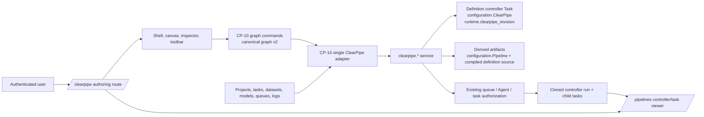
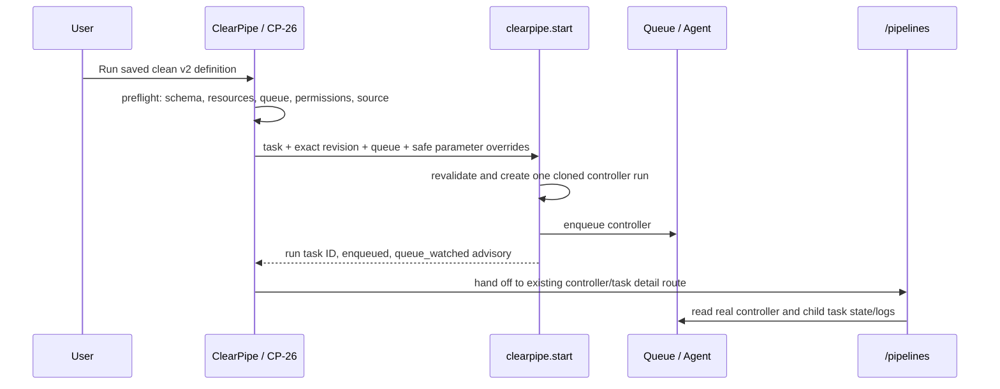
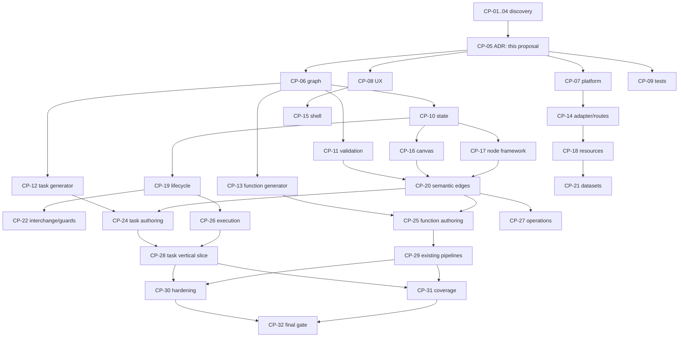

# CP-05 — ClearPipe architecture decision record and parity matrix

**Status:** Approved architecture contract (lead approval, 2026-07-22).
Decisions marked **Frozen** are the implementation contract; they do not claim
that implementation or runtime validation already exists.

**Evidence baseline:** `a6581e1` in worktree
`D:\Projects\clearml\.worktrees\cp-05`, incorporating the CP-01 through CP-04
handoffs.  Current ClearPipe WIP is the `9558961` baseline audited by CP-02.

## 1. Scope, precedence, and conclusion

ClearPipe is an authenticated visual authoring surface for a constrained,
versioned ClearML pipeline definition.  It is **not** a second pipeline
product, task database, scheduler, credential store, resource catalogue, or
operational dashboard.  Existing ClearML controller tasks, task/project
authorization, queues, Agents, and `/pipelines` remain the operational system.

Evidence precedence for a conflict is:

1. verified checked-in server/web behavior (CP-01 and CP-02);
2. verified ClearML source semantics and CP-03 fixtures;
3. this ADR after lead approval;
4. reference UX intent (CP-04), which never overrides backend semantics.

### Frozen decision summary

| ID | Decision | Status | Consequence |
|---|---|---|---|
| D-01 | `/clearpipe` authors definitions; `/pipelines` remains project/controller-run discovery, operational lifecycle, and detailed observability. | **Frozen** | Do not add a parallel `/pipelines` editor, list, history, or status API. |
| D-02 | The sole authoring truth is canonical **ClearPipe graph schema v2**. It contains typed task/function nodes, typed bindings, settings, approved visual metadata, and no transient/editor/runtime data. | **Frozen** | Canvas, forms, persistence, validation, preview, import, and generators consume this document; no component owns a shadow graph. |
| D-03 | Persist a definition as the existing tagged controller `Task` using `configuration.ClearPipe`; use `runtime.clearpipe_revision` for optimistic concurrency. `configuration.Pipeline`, script, and generated source are derived artifacts. | **Frozen** | Never write the legacy `Pipeline` projection as the authoring source or infer an editable graph from it. |
| D-04 | A save is a compare-and-swap update of that definition. “Save as” creates a new definition; current revisions are mutable edit tokens, **not** version history. | **Frozen** | No invented version list, immutable snapshot/history, or schedule surface. |
| D-05 | Canonical v2 execution targets the CP-03 imperative `PipelineController` lowering, invoked by the existing authenticated ClearPipe server lifecycle. The current generic `DagRunner` is legacy-only until it is replaced/adapted to invoke that same compiled definition. | **Frozen; integration gate** | Browser code never runs a pipeline. A v2 Run action stays disabled until CP-26 proves the server invocation path on a real supported Agent. |
| D-06 | One server-side deterministic compiler produces task and function source. Code preview/export display its no-launch definition output; the server-only launch wrapper is not editable source. | **Frozen** | No independently generated browser source and no editable code preview. |
| D-07 | Mixed task/function DAGs are supported only for the CP-03 five binding kinds and explicit cross-style references. Decorators, dynamic Python, arbitrary task-source import, and inferred task output schemas are rejected. | **Frozen** | A visual edge is never generic data transport. |
| D-08 | Server validation/authorization is authoritative. Client validation is early feedback over the same catalog and cannot permit, repair, or silently lower an invalid graph. | **Frozen** | Secret checks, resource/queue access, revision conflicts, and execution eligibility are rechecked on the server. |
| D-09 | Existing ClearPipe v1 and ordinary `/pipelines` controller representations are imported only if an analyzer proves lossless representability. Otherwise show read-only/unsupported with export/details handoff. | **Frozen** | No lossy partial canvas, automatic conversion, or mutation of a legacy definition. |
| D-10 | Current WIP’s six generic node kinds and hand-drawn node-to-node edges are not the v2 authoring model. Preserve useful route, access, lifecycle, secret, and service foundations; replace incompatible graph/canvas contracts behind the v2 boundary. | **Frozen** | Hide unsupported WIP choices rather than presenting them as runnable parity. |

## 2. Reconciled evidence and contradictions

| Finding | Reconciliation / decision |
|---|---|
| CP-01 found `/pipelines` has only `start_pipeline` and `delete_runs`, reads a controller task’s `Pipeline` configuration, and is read-only for graph editing. | This is the operational viewer boundary in D-01. It does not contradict CP-02’s ClearPipe CRUD service: the latter owns authored definitions, while `/pipelines` owns established run details and task lifecycle. |
| CP-02 found an actual `clearpipe.*` CRUD/revision service and controller-task persistence, but its WIP graph is six generic node types with untyped `{source,target}` edges and a custom `DagRunner`. | Reuse the controller-task persistence, access checks, CAS revision, queue authorization, and clone/enqueue lifecycle. Do not extend the generic node/edge contract or claim its runner implements CP-03 task/function semantics. |
| CP-03 selected imperative `PipelineController.add_step` / `add_function_step`, explicit function source, and five dependency classes. | This overrides any temptation to map an arbitrary WIP node or a reference card to an executable action. CP-03’s semantic fixtures define the supported lowering. |
| CP-03 golden source intentionally has no `.start()` or `.start_locally()` call, while CP-02’s current runner performs scheduling. | Definition generation stays pure and has no launch call. A server-only invocation wrapper may launch the already compiled definition; it must not hold an alternate graph/lowering. This requires CP-26 real-Agent proof before Run is enabled. |
| CP-04 suggests rich editor, resource, and collaboration experiences, while no generic visual-graph collaboration/scheduling persistence is verified. | Adopt interaction intent only where it maps to the canonical graph and verified services. Collaboration, arbitrary provider nodes, local execution, direct credentials, report executor, and scheduling are deferred or omitted below. |
| CP-01 reports no pipeline version API/history; CP-02 ClearPipe service increments an integer revision on update. | The integer is a CAS/edit revision. It is not an immutable product version. Save-as is a new definition; historical versions and schedules are unsupported. |
| CP-02 browser normalizes many DTO wrappers and silently turns resource failures into empty lists. | CP-07 freezes one typed v2 DTO/error contract; CP-14 implements one adapter. CP-18 must distinguish empty, denied, stale, and failed resources. |

## 3. System context and canonical responsibility model



| Concern | Sole authority | Stored or derived representation | Explicit non-authority |
|---|---|---|---|
| Authoring semantics and visual layout | Canonical v2 graph | `configuration.ClearPipe` on a tagged controller definition | Canvas library objects, browser storage, `Pipeline` monitoring JSON, generated source |
| Node identity | v2 `node.id` plus unique generated-safe `node.name` | Stable IDs and names, never display labels alone | Runtime child task IDs and DOM/canvas IDs |
| Resource identity | ClearML resource service / immutable resource ID | Safe ID plus optional stale display snapshot | Pasted opaque display text or secret-bearing connection data |
| Bindings and topology | v2 typed bindings + deterministic parent derivation | `data`, `artifact`, `parameter`, `inferred`, `execution-only` | Untyped `{source,target}` visuals and screen position |
| Validation | CP-11 catalog locally; server revalidation | Deterministic diagnostics addressed to graph/node/field/port/edge | A canvas connection or successful client check |
| Persistence and concurrency | `clearpipe.create/get_by_id/update` and revision CAS | Definition task/configuration and `runtime.clearpipe_revision` | `/pipelines` display version and browser-only snapshots |
| Generated definition | Server compiler from v2 graph | Deterministic no-launch Python plus source map/manifest | User-edited preview or a second browser generator |
| Execution | Existing ClearPipe authenticated clone/enqueue lifecycle, after v2 compiler integration | Immutable cloned controller run and child tasks | Browser runner, simulated status, local snippet execution |
| Run status/logs | Existing task/controller records and `/pipelines` | Real task/runtime/status/log data | Persisted authoring graph or fabricated card state |

### Canonical v2 shape and invariants

CP-06 owns the exact discriminated schema, migration registry, and fixture
format.  This ADR freezes the following non-negotiable shape rather than a
second implementation-specific model:

* document metadata: `schema_version: 2`, definition identity/revision supplied
  by the server, controller name/project/version/settings, declared pipeline
  parameters, tags, and approved visual metadata;
* executable node discriminators: **`task`** and **`function`**.  A task has an
  immutable base-task ID or a project/name fallback; a function has a
  self-contained module-level signature/source, explicit inputs, and ordered
  declared outputs;
* resource/dataset information is an ID-backed reference or an explicitly
  supported binding.  It is not an executable generic “dataset” card unless
  CP-21 proves a lowering and CP-06 adds its discriminator;
* all ports have stable IDs, direction, semantic role, multiplicity, and
  accepted binding kinds.  Node name, port ID, and resource ID survive label
  changes;
* only these dependency/binding kinds exist: `data`, `artifact`, `parameter`,
  `inferred`, and `execution-only`.  Multiple kinds may relate the same pair of
  nodes.  The compiler computes one sorted, deduplicated parent list;
* positions, dimensions if approved by CP-06, and viewport are visual metadata
  and persist with the document. Selection, hover, drag state, pending
  connection, panel/drawer state, request state, history stack, clipboard, and
  run polling state never persist in it;
* JSON-safe values only; no credentials, tokens, secret URLs, callable
  objects, functions, browser file contents, runtime task IDs, or executable
  code outside the constrained function source field.

An empty graph is a valid unsaved draft but cannot generate or run. A saved
document with unsupported fields remains intact as read-only/unsupported; it
is never “fixed” by dropping fields.

## 4. Data flows

```mermaid
sequenceDiagram
    participant E as Editor / CP-10
    participant A as CP-14 adapter
    participant S as clearpipe service
    participant T as Definition controller Task
    E->>E: command -> v2 graph; local diagnostics
    E->>A: validate/save typed document + expected revision
    A->>S: clearpipe.validate or clearpipe.create/update
    S->>S: authorize; validate graph/resources/queues; compile
    S->>T: write ClearPipe graph, derived Pipeline, source, revision CAS
    T-->>S: definition + new revision
    S-->>A: normalized definition/diagnostics
    A-->>E: replace saved baseline only on success
```



**Execution boundary:** `clearpipe.start`, not browser code and not a new
service, is the selected definition submission operation because it validates
the persisted graph/revision and returns the cloned run. `pipelines.start_pipeline`
remains the established `/pipelines` rerun operation; CP-14 must not call both
for one ClearPipe Run action. `queue_watched: false` is an advisory warning
after a successful enqueue, not a failed submission.

## 5. Persistence, generation, and execution decisions

### 5.1 Definition and revision lifecycle

1. **Create:** `clearpipe.create` creates a tagged `TaskType.controller`
   definition in its ClearPipe project and starts revision `1`.
2. **Read/list:** `clearpipe.get_all/get_by_id` returns the sole normalized
   definition DTO. `get_all` pagination remains server authoritative; no
   client-side “all definitions” contract.
3. **Update:** send the expected revision to `clearpipe.update`. A mismatch is a
   visible stale/conflict outcome: keep local edits, offer reload, compare
   once available, or Save As; never overwrite.
4. **Save As:** call create with a new name/definition identity. Do not call
   this an immutable version or suggest it creates revision history.
5. **Archive/delete:** use existing ClearPipe lifecycle endpoints with revision
   checks. The UI must follow the current deletion rule (archive first unless
   force is authorized), rather than mimicking `/pipelines.delete_runs`.
6. **Run:** only a saved, clean, validated, writable v2 definition may run.
   The run clones the definition and is immutable execution evidence; it is
   neither the next authoring revision nor a graph persistence target.

`configuration.ClearPipe` is canonical.  Current
`configuration.Pipeline` is a derived monitoring projection used by existing
controller views; it is intentionally lossy and must not be imported by
default.  The definition task’s script/source and its run clones are derived
from the canonical graph.  CP-19 must compare logical v2 documents, not raw
server envelope order, script text, or runtime status.

### 5.2 Single deterministic lowering

The generator contract is server-side to ensure the previewed definition is
the one persisted/used by execution:

1. CP-12 emits task-node `PipelineController.add_step` calls.
2. CP-13 emits module-level constrained function definitions followed by
   `PipelineController.add_function_step` calls.
3. A single orchestrator emits deterministic imports, controller construction,
   parameters, topological node calls, sorted parent lists, source-map records,
   and an embedded manifest/checksum. It emits **no** start/local/debug call.
4. The server persists that source as a derived artifact and exposes it through
   the typed validate/read contract for CP-23 preview and CP-22 export.
5. The server’s launch-only wrapper consumes that already compiled definition
   and invokes the approved ClearML controller mechanism. It may add no nodes,
   bindings, defaults, queues, or retry semantics and may not parse/execute
   user source to infer them.

This separates a reproducible definition artifact from launch mechanics
without creating a second graph or generator. The current
`controller_runner.py` is evidence of an existing server-side lifecycle, but
its generic-node adapter is **not** proof that it executes the selected
imperative subset. It is legacy-only until CP-12/CP-13/CP-26 prove the
replacement/adaptation described above.

### 5.3 Supported mixed-mode subset

Task and function nodes share one controller DAG. Supported relationships are:

| Source → target | Allowed form | Required lowering |
|---|---|---|
| pipeline parameter → task/function input | declared `parameter` binding | `${pipeline.name}` in override/kwargs |
| task → task | explicit task parameter/artifact/model/ID reference or `execution-only` parent | ClearML reference grammar plus sorted parent when required |
| function output → function input | declared `data` binding only | `${producer.output}` input-artifact reference plus inferred parent |
| task ↔ function | execution parent; or an explicit compatible task artifact/ID/string binding | Never infer task output ports or generic object transport |
| any nodes | `execution-only` | ordered `parents`, no value transfer |

The following are rejected, not approximated: decorator pipelines; callbacks,
base-task factories, callable retry/serializers; loops, branches, dynamic
expressions; closures/lambdas/async/generator functions; local/debug launch;
unknown nested reference grammar; generic non-JSON values; and any secret
value. CP-11 implements CP-03’s `CPSEM001`–`CPSEM011` catalog as the stable
semantic baseline, preserving exact target paths and no silent edge/output
loss.

## 6. Functional parity matrix

“Adopt” means retain the user outcome using ClearML semantics; “Adapt” means
the interaction is valuable but its data/action changes; “Omit” means it must
not be surfaced as product capability; “Defer” means no production claim until
the stated backend contract exists.

| Reference capability | Decision | Owner(s) | Frozen boundary / reason |
|---|---|---|---|
| Three-region editor, centered command surface, collapsible panels | **Adopt** | CP-08, CP-15 | One ClearPipe shell using existing application layout; no mode-specific shells. |
| Palette search, drag insertion, click/keyboard Add alternative | **Adapt** | CP-16, CP-17, CP-27 | Catalog exposes only registered v2 capabilities. |
| Pan, zoom, fit, minimap, grid, selection | **Adapt** | CP-16 | Adapter renders CP-10 state; controls have accessible alternatives. |
| Typed directional ports, labels, connect/reconnect/delete | **Adapt** | CP-06, CP-11, CP-20 | Only the five canonical binding kinds; reject invalid direction/type/multiplicity/cycle. |
| Dense cards, category/status styling, inspector tabs | **Adapt** | CP-17 | Visual category is not execution meaning; real validation/resource/run state only. |
| Move, duplicate, copy/paste, multi-select, nudge, undo/redo | **Adapt** | CP-10, CP-27 | All changes use commands, remap IDs/references, and do not undo remote resources/runs. |
| New/open/name/rename/save/save-as/archive/delete | **Adapt** | CP-14, CP-19, CP-23 | Existing ClearPipe definition lifecycle/CAS, not `/pipelines` CRUD. |
| Import/export and unsaved guard | **Adapt** | CP-06, CP-22, CP-23 | Versioned secret-free graph only; source import is exact generated subset only. |
| Task selection and task-backed configuration | **Adapt** | CP-18, CP-24 | Real authorized resources and CP-03 task bindings; runtime ID is not base identity. |
| Function/component authoring and output connections | **Adapt** | CP-13, CP-25 | Explicit constrained source/signature/ports only; no evaluation or signature guessing. |
| Dataset browser/version selection | **Adopt** | CP-18, CP-21 | Reuse real ClearML dataset concepts; a dataset becomes executable only with an approved lowering. |
| Resource selectors, stale/error/denied states | **Adapt** | CP-18 | Never convert unavailable data into an empty successful list. |
| Read-only graph-driven code preview, copy/download | **Adopt** | CP-12, CP-13, CP-23 | Displays one server compiler’s no-launch output; manual edit is omitted. |
| Run action, queue choice, concise graph status | **Adapt** | CP-14, CP-26 | Real `clearpipe.start`/task records only, with clear preflight and `queue_watched` warning. |
| Detailed task/controller logs, results, operations | **Adapt / hand off** | CP-26 | ClearPipe links to existing `/pipelines` and task detail; no duplicate operational dashboard. |
| Existing `/pipelines` → visual edit | **Adapt, constrained** | CP-14, CP-29 | Exact lossless generated representation only; all others read-only/unsupported. |
| Sharing indicator, members, real-time cursors/presence | **Defer** | Lead, CP-19 | Existing task/project access is authoritative; no co-edit protocol/conflict model. |
| Direct credential/connection fields | **Omit** | CP-07, CP-18 | Only approved opaque references/session/Agent configuration; never values. |
| Arbitrary providers, trackers, DVC/Git LFS/MLflow/W&B/Comet controls | **Omit** | CP-05, CP-17 | No verified ClearML-native lowering; current WIP options are not parity. |
| Browser upload as a node source | **Omit** | CP-21, CP-24, CP-25 | No verified upload-to-supported-reference contract. |
| Local arbitrary snippets / pretend skipped success | **Omit** | CP-26 | Conflicts with queue/Agent semantics; unsupported work blocks Run. |
| Synthetic report executor | **Defer** | Lead, CP-21, CP-25 | Add only after a verified artifact/report lowering exists. |
| Scheduling and schedule history | **Defer** | Lead, CP-07 | No current `pipelines.*` or ClearPipe schedule contract. |
| Responsive drawers, focus, announcements, reduced motion | **Adopt** | CP-08, CP-15, CP-30 | Required product quality, not optional visual polish. |

## 7. Ownership and file/contract boundaries

### 7.1 Reserved shared files

The following reservation avoids concurrent redefinition. “Create” is a
planned exact path, not a production change in this ADR.

| Path | Owner | Rule |
|---|---|---|
| `clearml-server\apiserver\schema\services\clearpipe.conf` and `clearml-server\apiserver\apimodels\clearpipe.py` | CP-07 | Replace generic `object` endpoint declarations with typed v2 request/response contracts; no feature task edits these directly. |
| `clearml-server\apiserver\services\clearpipe.py` | CP-07 contract, CP-14 integration | Preserve task/access/CAS/clone-enqueue boundary. Changes require CP-07 contract fixtures and CP-14 integration tests. |
| `clearml-server\apiserver\bll\clearpipe\graph_v2.py` **(create)** and `...\migrations.py` **(create)** | CP-06 | Server authority for schema parsing/migration/unsupported outcome; no UI import of server code. |
| `clearml-web\src\app\features\clearpipe\domain\graph-v2.types.ts` **(create)** and `...\graph-v2-codec.ts` **(create)** | CP-06 | Typed client projection of the CP-06 contract; it must be fixture/contract-tested against the server schema and may not invent fields. |
| `clearml-web\src\app\features\clearpipe\clearpipe.models.ts` | CP-06 | Retire WIP six-node definitions and broad normalization into a temporary legacy adapter only; do not add new canonical semantics here after CP-06. |
| `clearml-server\apiserver\bll\clearpipe\generation\contracts.py` **(create)** | CP-06 | Lowering input/output interfaces and source-map/manifest contract only. |
| `...\generation\task.py` **(create)** and `...\compiler.py` | CP-12 | Sole task lowering and orchestrator integration point. CP-13 contributes only through the function plug-in contract. |
| `...\generation\function.py` **(create)** | CP-13 | Sole imperative function-step lowerer; it never edits the task lowerer or browser preview. |
| `clearml-server\apiserver\bll\clearpipe\validation.py` | CP-11 | Replace/adapt WIP validation to consume v2 semantics and stable diagnostics. |
| `clearml-server\apiserver\bll\clearpipe\controller_runner.py` | CP-12, with CP-26 proof | Legacy current-runner compatibility only until it is a launch-only wrapper for the one compiled definition. Feature UI tasks must not modify it. |
| `clearml-web\src\app\features\clearpipe\clearpipe-api.service.ts` and `...\platform\clearpipe-adapter.service.ts` **(create)** | CP-14 | One browser adapter over `SmApiRequestsService`; CP-18/19/21/24/26 never import production clients directly. |
| `clearml-web\src\app\features\clearpipe\clearpipe-state.service.ts` and `...\domain\graph-store.service.ts` **(create)** | CP-10 | Migrate WIP editor signals behind one command/selectors façade; no canvas/service-owned graph store. |
| `clearml-web\src\app\features\clearpipe\editor\clearpipe-editor.component.*` | CP-15 | Convert to the slot-based workspace composition boundary; CP-23/26 mount slots rather than own the shell. |
| `...\editor\clearpipe-canvas.component.*` | CP-16 | Canvas event adapter only; CP-20 adds semantic connector adapters, not an edge model. |
| `...\editor\clearpipe-config-panel.component.*` | CP-17 | Generic inspector host only; CP-21/24/25 register domain forms through typed extensions. |
| `clearml-web\src\app\app.routes.ts`, `...\features\clearpipe\clearpipe.routes.ts`, and `...\layout\side-nav\side-nav.component.html` | CP-14 | Preserve guarded `/clearpipe`; add approved `/pipelines` entry points through route helpers only. |

### 7.2 Packet-level boundaries and handoffs

| Packet | Sole deliverable boundary | Consumes / publishes | Must not do |
|---|---|---|---|
| CP-06 | v2 schema, IDs, ports, migrations, canonical fixtures | Publishes document/binding contract to CP-10–13/19/20/22 | State engine, network client, credentials |
| CP-07 | Typed endpoint, capability, permission, route contract | Publishes adapter contract to CP-14 | Add a database, scheduler, or undocumented endpoint |
| CP-08 | Shell/UX/accessibility specification | Publishes slots and state presentation to CP-15/18 | Define graph semantics or server contracts |
| CP-09 | Fixtures, fakes, golden and command policy | Publishes harness to all implementation tasks/CP-31 | Treat fakes as integration proof |
| CP-10 | One graph command/store and transient boundary | Publishes commands/selectors to CP-16/17/19/22/27 | Canvas state, validation, I/O, a second store |
| CP-11 | One diagnostic/preflight catalog and resolver interface | Publishes diagnostic targets to CP-19/20/23/26 | Network calls, UI rendering, auto-repair |
| CP-12 | Task lowering and compiler orchestration registration | Publishes source map/output to CP-23/24/26 | Function semantics, execution, UI |
| CP-13 | Function lowering plug-in and constrained import shape | Publishes source map/output to CP-23/25/26 | Decorator/arbitrary-source support or browser generator |
| CP-14 | Single production adapter, guards, routes, normalized errors | Publishes platform façade to CP-18/19/21/24/26/29 | Graph/domain mutations or duplicate clients |
| CP-15 | One slot-based workspace shell and first-use states | Publishes shell slots to CP-16/17/19/22/23/26 | Canvas semantics, save/run implementation |
| CP-16 | Canvas rendering/event translation | Consumes CP-10; publishes rendering hooks to CP-17/20/27 | Persist library event objects or decide compatibility |
| CP-17 | Generic catalog/card/port/inspector extension registry | Publishes extensions to CP-21/24/25 | Resource/task/function-specific form logic |
| CP-18 | Shared resource queries/selectors and resolvers | Publishes resource states to CP-11/21/24/25 | Direct credential storage or feature-specific clients |
| CP-19 | New/open/save/reload/CAS lifecycle | Consumes CP-10/14/15; publishes dirty/lifecycle API | Import/export, run submission, second persistence |
| CP-20 | One port compatibility and semantic-edge interaction layer | Consumes CP-11/16/17; publishes bindings | Generic untyped edges or duplicate cycle checks |
| CP-21 | Dataset browser and only approved dataset bindings | Registers through CP-17/18 | Fake upload/provider actions or an executable dataset claim without lowering |
| CP-22 | Graph interchange, constrained source import, leave guards | Consumes CP-06/10/15/19; publishes actions to CP-23/29 | Arbitrary code conversion/evaluation |
| CP-23 | Toolbar and read-only compiled preview | Consumes lifecycle/diagnostics/generators; exposes Run hook to CP-26 | Manual source editing or management UI duplication |
| CP-24 | Task node extension/forms | Registers CP-12 semantics through CP-17/18/20 | Runtime base IDs or direct API calls |
| CP-25 | Function node extension/forms | Registers CP-13 semantics through CP-17/18/20 | Execute/inspect arbitrary source or mix styles |
| CP-26 | Preflight/submission/status mapping and `/pipelines` handoff | Consumes all existing services via CP-14 | Browser runner, fake statuses, full ops dashboard |
| CP-27 | History, clipboard, multi-select, keyboard/layout over commands | Consumes CP-10/16/17/19/20 | Another history/dirty model or file interchange |
| CP-28 | Two-task production-connected vertical slice | Integrates existing owners and records defects | Replacement implementations or optional scope |
| CP-29 | Existing-pipeline representability/read-only conversion | Consumes CP-14/19/22/24/25 | Lossy conversion or `/pipelines` rewrite |
| CP-30 | Integrated accessibility/responsive/performance hardening | Fixes in owning modules; informs CP-32 | Change graph semantics for performance |
| CP-31 | Layered coverage plus `/pipelines` regressions | Consumes CP-09 fixtures; informs CP-32 | Hide defects behind mocks |
| CP-32 | Evidence-only release-quality report | Consumes all prior evidence | New feature scope or unverified pass claims |

## 8. Ordered milestones and dependency graph



Ordered implementation milestones:

1. **Contract fan-out (CP-06–09):** approve v2 graph, typed server/adapter
   contract, shell/accessibility contract, and deterministic fixtures together.
   No implementation task starts by defining a local substitute.
2. **Pure foundations (CP-10–15):** command store, diagnostics, server
   compiler plug-ins, one adapter, and slot-based shell. The CP-03 fixture
   output is the generator baseline.
3. **Editor/lifecycle foundation (CP-16–19):** canvas and generic components
   consume commands; resource selection consumes the adapter; lifecycle owns
   save/reload and CAS.
4. **Semantic surfaces (CP-20–23):** bindings, datasets, guarded interchange,
   and read-only preview attach through the prior registries.
5. **Authoring/execution completion (CP-24–27):** task/function registrations
   and real submission/status mapping; advanced operations only wrap commands.
6. **Convergence (CP-28–29):** prove the two-task real-service journey and
   representability/read-only behavior independently.
7. **Hardening/release (CP-30–32):** accessibility/performance and regression
   run in parallel, followed by one evidence-only final gate.

The graph above is consistent with the hard-dependency manifest in
`clearpipe-task-plan\00_EXECUTION_PLAN.md` lines 107–142. A task may begin
only when its own listed dependencies are merged or expose a reviewed contract.

## 9. Migration and reuse plan

| Asset / data | Decision | Migration rule |
|---|---|---|
| ClearPipe definition controller task, access checks, CAS revision, archive/delete, clone/enqueue | **Preserve and adapt** | Keep the task-backed service boundary and authorization. CP-07 makes DTOs exact; CP-14 is the only browser consumer. |
| `configuration.ClearPipe` v1 WIP document | **Read-only unsupported by default** | Do not auto-map the six WIP node types to v2 task/function semantics. Preserve raw data, offer safe export/details, and permit edit only after CP-29 proves a lossless named migration. |
| WIP `configuration.Pipeline` projection | **Derived compatibility projection** | Retain for controller monitoring only. Never use it to create/save v2 authoring state. |
| WIP compiler + `controller_runner.py` | **Adapt, gated** | Retain only legacy behavior until the source/launch path exactly matches the v2 compiler. CP-26 must prove one real Agent execution before v2 Run exposure. |
| WIP browser API route/library/editor unsaved/conflict flow | **Preserve and adapt** | Keep one `SmApiRequestsService` adapter and guarded route. Replace broad wrappers, generic state, and unsupported inspector controls behind CP-06/10/14 contracts. |
| WIP CDK/SVG graph canvas | **Replace behind CP-16 adapter** | It has no semantic ports/edges/accessibility-complete behavior. It may remain only as an implementation detail if it consumes no shadow graph. |
| Existing `/pipelines` list/controller detail/run UI | **Reuse, do not rewrite** | Link to existing project/controller/task details and keep its own start/delete lifecycle intact. Add only approved entry/handoff links through CP-14. |
| Ordinary legacy controller tasks / arbitrary PipelineController Python | **Constrained read-only** | CP-29 imports only an exact deterministic ClearPipe-generated imperative shape with verified manifest; otherwise names blockers and hands off to details/code. |
| Old v2 graph schema in the future | **Explicit migration** | CP-06 migration registry must be deterministic, preserve all supported data, and return unsupported/read-only before mutation; no “best effort” field drop. |
| Browser local storage and URL/exported query state | **Not a production store** | May hold transient UI preference only if CP-08 approves; never graph, secret, run, or unsaved-draft authority. |

## 10. Verified backend limitations and required fallbacks

| Verified limitation | Evidence | Required product behavior / owner |
|---|---|---|
| `/pipelines` exposes only start/clone/enqueue and delete-runs; it has no graph CRUD, version history, schedule, or status API. | CP-01 §§1, 5, 6; `clearml-server\apiserver\services\pipelines.py` `start_pipeline`/`delete_runs` | CP-07/14 use ClearPipe definition APIs for authoring and existing task/project APIs for observation; omit schedule/history. |
| ClearPipe service persists a graph and CAS revision, but its public schema declares all endpoint payloads `object`. | `clearml-server\apiserver\services\clearpipe.py:104-167, 283-403`; `...\schema\services\clearpipe.conf:3-55` | CP-07 replaces the generic endpoint shape before downstream contracts rely on it. |
| Current WIP accepts only six generic types and simple node-level edges; its compiler normalizes every edge into a parent. | `...\bll\clearpipe\validation.py:9-17, 94-141`; `...\compiler.py:16-52` | CP-06/11/12/13 must not extend that model. Legacy only until v2 lowering is proven. |
| Current runner clones/tasks or creates generic scripts and schedules them itself; it does not demonstrate CP-03 `add_step`/`add_function_step` lowering. | `...\bll\clearpipe\controller_runner.py:226-390` | D-05 gate: CP-26 must prove the server wrapper invokes the compiled imperative definition; no v2 fake run. |
| ClearML function conclusions are source-validated at ClearML `77e66d8c…`; no ClearML package was installed in the discovery worktree. | CP-03 lines 9–40 | CP-26 environment/Agent smoke is mandatory before Run is called supported. |
| Queue worker observation is advisory after enqueue. | `...\services\clearpipe.py:483-491`; CP-01 §3 | Show submitted + unwatched-worker warning separately; do not roll back the run. |
| Current browser adapter accepts response wrappers and requests up to 500 results; config panel converts resource request failures to `[]`. | `clearml-web\src\app\features\clearpipe\clearpipe-api.service.ts:23-33, 92-111`; CP-02 lines 103–105, 140 | CP-07/14 normalize one response; CP-18 adds paging/cancel/error/retry/denied distinctions. |
| Current ClearPipe feature flag defaults true and route guard merely sends disabled users to `/404`. | CP-02 lines 27–29; `clearml-web\src\app\app.routes.ts:29-33` | Lead must approve release default; CP-14 preserves guard and CP-15 supplies accurate unavailable/read-only states where authorization permits. |
| Existing browser tests cannot run in this isolated worktree because web `node_modules` is absent. | CP-02 lines 203–211 | CP-09/31 record CI/installed-environment results; this ADR makes no browser-test pass claim. |

## 11. Risks and implementation guardrails

| Risk | Guardrail / owner |
|---|---|
| A second graph emerges in the canvas, preview, server compiler, or `/pipelines`. | CP-06 schema + CP-10 commands are the only authoring authority; all other forms are projections. Test round-trip and source-map identity. |
| Current WIP runner and selected ClearML lowering diverge. | Do not enable v2 Run until CP-26 executes CP-03 task/function fixtures through a supported Agent and proves the stored definition/source relationship. |
| Unsupported reference UX is shipped as a success state. | Registry only exposes validated capabilities. CP-11 blocks generation/run and CP-17/26 explain why. |
| Secrets leak through graph, generated source, export, URL, logs, or browser storage. | Server rejects; client preflights; opaque approved IDs only; CP-22 and CP-31 inspect all artifacts. |
| Revision conflict silently overwrites work. | Expected revision on every mutation; preserve local document and present reload/compare/save-as outcome. |
| Legacy graph/pipeline conversion drops behavior. | CP-29 requires representability analysis and read-only fallback. `Pipeline` monitoring JSON is never enough by itself. |
| A convenience feature duplicates a resource client, routes, or task operations. | CP-14 is the only production platform import boundary; CP-18 owns shared resource queries; CP-26 hands operations to `/pipelines`. |
| Validator/canvas/generator disagree on an edge. | CP-11 owns catalog/compatibility core; CP-20 calls it; CP-12/13 consume canonical bindings; fixtures include valid/invalid cases. |
| Transient changes create false dirty/re-generation. | CP-10/19 compare persisted logical document only; CP-23 regenerates on relevant domain changes; panel/polling/selection is transient. |
| Accessibility is deferred. | CP-08 requirements apply to every UI packet; CP-30 audits drag alternatives, focus, labels, announcements, motion, and narrow layouts. |

Non-negotiable implementation rules:

1. Do not create a ClearPipe database, scheduler, auth path, secret store,
   browser runner, pipeline client, resource client, or graph store.
2. Do not call production APIs from graph/domain code or feature forms; use the
   CP-14/18 boundaries.
3. Do not automatically convert, drop, repair, execute, or simulate unsupported
   graph/code/resource behavior.
4. Do not make generated source editable. Import is AST-only and only for the
   documented generated form with a verified manifest.
5. Generated source is deterministic by logical document, not position/history;
   graph export is deterministic and excludes runtime/transient state.
6. Preserve real task/project/queue permission checks. Client feature flags and
   disabled buttons are never an authorization substitute.
7. Every new binding, node discriminator, persisted field, or backend capability
   needs CP-06 migration semantics, CP-11 validation, CP-09 fixtures, and an
   owner impact review.

## 12. Lead review record

The lead approved these bounded recommendations on 2026-07-22. They do not
authorize an implementation to ignore a frozen decision.

| Gate | Recommendation | Why lead approval is needed | Downstream effect |
|---|---|---|---|
| L-01: v2 execution transition | Approve D-05: adapt/replace the generic runner with a launch-only wrapper around the one imperative compiler; retain current runner only for legacy definitions. | CP-03 semantics and the current runner are materially different. | CP-12/13/26 may not claim executable function/task graphs before CP-26 Agent proof. |
| L-02: legacy ClearPipe v1 policy | Approve read-only/unsupported-by-default, export-preserving migration policy. | Six WIP generic node types cannot be losslessly mapped to v2. | CP-19/22/29 implement no automatic conversion. |
| L-03: feature availability default | Approve whether `clearpipeEnabled` remains true during rollout or is disabled until CP-28 proof. Recommended: gate v2 Run and unsupported WIP nodes even if route remains visible. | Current default true is explicitly marked for release review by CP-02. | CP-14/15 route/nav messaging and release config. |
| L-04: typed contract extension | Approve CP-07 extending the existing `clearpipe.*` responses (not adding a new service) to expose canonical graph, diagnostics, compiled no-launch source/source map, and normalized errors. | Current schema is generic and preview otherwise invites a second browser generator. | CP-07/12/13/14/23 contract and fixture work. |
| L-05: real-Agent compatibility | Accept “execution unsupported until proven” as a release gate. | CP-03 evidence is source-level only; queue, Agent, package, permissions, and serializer behavior are environment-dependent. | CP-26/28 must record exact run evidence; no fallback/simulated completion. |
| L-06: future scheduling/collaboration/reports | Keep deferred; require a separate ADR with service, persistence, permission, conflict, and lifecycle evidence. | No verified protocol/endpoint exists. | No packet may expose controls as operational capability. |

**Approval record:** L-01 through L-06 are approved as written. The `/clearpipe`
route may remain visible under the existing feature flag, but v2 Run and all
unsupported WIP capabilities remain unavailable until their stated proof gates
are met. Any change to these decisions requires an ADR update and an impact
review of every affected contract owner.

## 13. Evidence references and reproducible checks

### Primary evidence

* `clearpipe-task-plan\CP-01_PIPELINES_ARCHITECTURE.md` — route/service
  boundary, clone-and-enqueue behavior, `/pipelines` limitations, and
  `/pipelines` reuse map.
* `clearpipe-task-plan\CP-02_CLEARPIPE_AUDIT.md` — actual WIP route/server
  inventory, graph/canvas limitations, preserve/adapt matrix, and test limits.
* `clearpipe-task-plan\CP-03_CLEARML_PIPELINE_SEMANTICS.md` — selected
  imperative function generation, five binding kinds, rejection catalog, and
  source-validated ClearML semantics.
* `clearpipe-task-plan\fixtures\cp-03\two-step-task.yaml` and
  `two-step-task.expected.py` — task reference/parent lowering fixture.
* `clearpipe-task-plan\fixtures\cp-03\two-function.yaml` and
  `two-function.expected.py` — module-level function/data/inferred-parent
  lowering fixture.
* `clearpipe-task-plan\CP-04_REFERENCE_UX.md` — parity intent, unsupported
  behavior, non-happy-path, accessibility, and responsive requirements.
* `clearpipe-task-plan\00_EXECUTION_PLAN.md` — authoritative ordered packet
  dependency manifest.

### Checked source locations

* Definition persistence, CAS, compiled configuration, and submission:
  `clearml-server\apiserver\services\clearpipe.py:75-167, 283-491`.
* Existing ClearPipe endpoint models/schema:
  `clearml-server\apiserver\apimodels\clearpipe.py:8-61` and
  `clearml-server\apiserver\schema\services\clearpipe.conf:3-55`.
* Current generic graph compiler/runner:
  `clearml-server\apiserver\bll\clearpipe\compiler.py:8-84` and
  `clearml-server\apiserver\bll\clearpipe\controller_runner.py:226-390`.
* Current server secret/graph validation:
  `clearml-server\apiserver\bll\clearpipe\validation.py:9-277`.
* Existing `/clearpipe` guard/routes:
  `clearml-web\src\app\app.routes.ts:29-33` and
  `clearml-web\src\app\features\clearpipe\clearpipe.routes.ts:4-19`.
* Current WIP browser model/state/adapter:
  `clearml-web\src\app\features\clearpipe\clearpipe.models.ts:3-178`,
  `clearpipe-state.service.ts:12-177`, and
  `clearpipe-api.service.ts:15-137`.

### Commands to reproduce this ADR’s static evidence

Run from `D:\Projects\clearml\.worktrees\cp-05`:

```powershell
git status --short --branch
git --no-pager log -1 --oneline

Select-String -Path clearml-server\apiserver\services\clearpipe.py `
  -Pattern '^def (create|get_all|get_by_id|update|validate|start|archive|delete)|^def _graph|^def _revision|^def _configurations'

Select-String -Path clearml-server\apiserver\bll\clearpipe\validation.py `
  -Pattern 'SUPPORTED_NODE_TYPES|embedded_secret|graph_cycle|duplicate_connection'

Select-String -Path clearml-server\apiserver\bll\clearpipe\compiler.py `
  -Pattern 'normalize_pipeline|render_controller_script|compile_definition'

py -3 -m compileall -q clearpipe-task-plan\fixtures\cp-03

@'
from hashlib import sha256
from pathlib import Path
root = Path("clearpipe-task-plan/fixtures/cp-03")
expected = {
    "two-step-task.expected.py": "461CB057C0A47BA862AD5F3882C3137353EF59304E95BF0FA50410615F77B6ED",
    "two-function.expected.py": "558726ED15A50F80FAD62AC11FDF99C3AD86C31B47EB4CB98DEC5B872A8FAB90",
}
for name, digest in expected.items():
    raw = (root / name).read_bytes()
    text = raw.decode("utf-8")
    assert sha256(raw).hexdigest().upper() == digest, name
    assert ".start(" not in text and ".start_locally(" not in text, name
assert "${pipeline.dataset_url}" in (root / "two-step-task.expected.py").read_text()
assert "${stage_data.artifacts.dataset.url}" in (root / "two-step-task.expected.py").read_text()
assert "${normalize.normalized}" in (root / "two-function.expected.py").read_text()
print("cp-03 fixture hashes/references/no-launch: OK")
'@ | py -3 -
```

### CP-05 verification record (2026-07-22)

| Command | Result |
|---|---|
| `git diff --check` | Passed for the tracked worktree diff. The staged-file check is repeated before this ADR is committed. |
| `py -3 -m compileall -q clearpipe-task-plan\fixtures\cp-03` | Passed. Generated bytecode was removed after the check. |
| CP-03 SHA/reference/no-launch standard-library assertion above | Passed: both raw-file hashes match, required references are present, and neither snapshot calls `.start()` or `.start_locally()`. |
| ADR completeness assertion above | Passed: all required ADR sections, both `CPSEM001`/`CPSEM011` bounds, and four diagrams are present. |
| `py -3 apiserver\tests\verify_clearpipe_schema.py` from `clearml-server` with `PYTHONPATH` set | Blocked before test collection: `ModuleNotFoundError: No module named 'attr'`. No dependencies were installed for this documentation-only packet. CP-09/CP-31 must run it in the established server environment. |

The fixture checks are syntax/determinism checks only; they do not execute
tasks, functions, queues, or a ClearML Agent. CP-26/CP-28 own runtime evidence.
