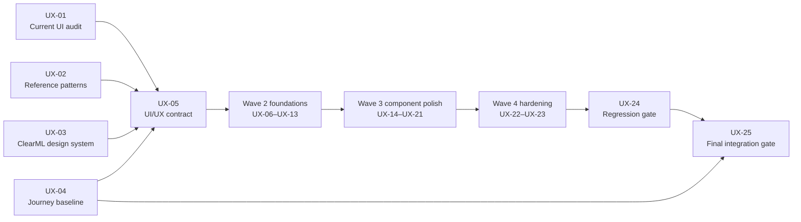

# ClearPipe UI/UX fleet execution plan

## Purpose

This directory is a **UI/UX-only remediation plan** for the nearly completed ClearPipe implementation. It decomposes the visual and interaction work into **25 independently assignable Markdown packets** with explicit dependencies, ownership boundaries, acceptance criteria, and verification.

The plan preserves all working domain behavior. It does not authorize agents to redesign graph semantics, persistence, code generation, validation, execution, permissions, or `/pipelines` integration.

## Product direction

- Use the NJ-Labs ClearPipe project for interaction structure: node discovery, panel layout, graph editing, contextual configuration, and immediate feedback.
- Use the current ClearML workspace for all visual styling, tokens, components, terminology, routes, data, permissions, and state.
- Implement a **user-facing Node Library / node store** that is data-driven and resource-backed, but calls the existing canonical graph create-node command.
- Keep the canvas dominant.
- Keep node cards compact and scannable; configuration belongs in the inspector.
- Use purposeful motion only. Ordinary idle edges remain static.
- Make drag interactions optional rather than mandatory.
- Fix complete journeys, not isolated screenshots.

See [00_REFERENCE_FINDINGS.md](./00_REFERENCE_FINDINGS.md) for the reference adaptation.

## Fleet operating model

### Use subagents here

- **Wave 0:** assign one agent to each of UX-01 through UX-04.
- **Wave 2:** assign one agent to each ready foundation packet, up to eight concurrent agents.
- **Wave 3:** assign one agent to each node family or interaction surface, up to eight concurrent agents.
- **Wave 4:** run accessibility and responsive/performance hardening concurrently.

### Keep under the lead agent

- UX-05: contract convergence and shared ownership.
- Any breaking change to a shared foundation contract.
- Cross-branch conflict resolution.
- UX-24: integrated regression gate review.
- UX-25: final usability and release decision.

### Branch and worktree policy

1. One task, one branch/worktree, one directly responsible agent.
2. The branch name should contain the task ID.
3. Each agent reads UX-05 and its own packet before editing.
4. Shared foundation files have one owner. Variant agents add registrations or extension modules.
5. Agents do not reformat unrelated files.
6. Every handoff includes changed files, before/after evidence, fixtures, test commands/results, blockers, and contract changes.
7. The lead updates [00_STATUS_CHECKLIST.md](./00_STATUS_CHECKLIST.md) after every merge.

## Execution graph

A wave is a scheduling aid, not permission to ignore dependencies. A task may begin as soon as all of its own hard dependencies are complete.

## Wave plan

| Wave | Name | Tasks | Maximum parallel owners | Points | Parallel/sequential rule | Exit condition |
|---:|---|---|---:|---:|---|---|
| 0 | Parallel UI evidence | [UX-01](./ux_01_audit-current-clearpipe-ui.md), [UX-02](./ux_02_study-reference-node-library.md), [UX-03](./ux_03_inventory-clearml-design-system.md), [UX-04](./ux_04_define-usability-journeys.md) | 4 | 20 | Four agents independently gather current-state, reference, design-system, and journey evidence. | Evidence packs are complete and every P0/P1 defect has an owner candidate. |
| 1 | Sequential design gate | [UX-05](./ux_05_freeze-uiux-contract.md) | 1 | 5 | Lead agent reconciles evidence and freezes shared visual/interaction contracts. | `UIUX_CONTRACT.md`, target states, motion policy, and ownership map are approved. |
| 2 | Parallel UI foundations | [UX-06](./ux_06_workspace-shell-panels.md), [UX-07](./ux_07_node-library-user-store.md), [UX-08](./ux_08_canvas-surface-controls.md), [UX-09](./ux_09_shared-node-card-system.md), [UX-10](./ux_10_inspector-shell.md), [UX-11](./ux_11_toolbar-action-hierarchy.md), [UX-12](./ux_12_motion-feedback-system.md), [UX-13](./ux_13_visual-fixture-harness.md) | 8 | 55 | Eight agents implement independent foundations against UX-05. Shared primitives have one owner. | Shell, library, canvas, base card, inspector, toolbar, motion, and fixtures are stable. |
| 3 | Parallel component polish | [UX-14](./ux_14_task-component-node-visuals.md), [UX-15](./ux_15_dataset-resource-node-visuals.md), [UX-16](./ux_16_code-function-node-visuals.md), [UX-17](./ux_17_ports-edges-connection-ux.md), [UX-18](./ux_18_resource-search-selector-browser.md), [UX-19](./ux_19_inspector-forms-validation.md), [UX-20](./ux_20_execution-status-logs-results.md), [UX-21](./ux_21_overlays-empty-loading-error-unsaved.md) | 8 | 55 | Eight agents implement node families and interaction surfaces through the foundation extension points. | All supported node families and cross-surface UX states are polished through shared contracts. |
| 4 | Parallel hardening | [UX-22](./ux_22_accessibility-keyboard-reduced-motion.md), [UX-23](./ux_23_responsive-density-performance.md) | 2 | 16 | Two specialists harden accessibility and responsive/performance behavior on the integrated UI. | Accessibility, keyboard, reduced motion, responsive behavior, and representative graph performance pass. |
| 5 | Regression gate | [UX-24](./ux_24_visual-interaction-regression.md) | 1 | 8 | One quality agent builds integrated visual and interaction regression coverage. | Visual and interaction suites pass twice from a clean workspace. |
| 6 | Sequential completion gate | [UX-25](./ux_25_final-uiux-integration-gate.md) | 1 | 5 | Lead agent performs final merge, usability review, release checks, and completion decision. | All completion criteria pass and no P0/P1 defect remains. |

## What can run in parallel

### Discovery

UX-01, UX-02, UX-03, and UX-04 inspect different evidence sources and should run concurrently.

### Foundations

After UX-05, UX-06 through UX-13 can run concurrently because they own distinct primitives:

- UX-06 owns shell and panels.
- UX-07 owns the Node Library.
- UX-08 owns the canvas surface and controls.
- UX-09 owns the base node card.
- UX-10 owns the inspector shell.
- UX-11 owns the toolbar.
- UX-12 owns motion primitives.
- UX-13 owns fixtures and screenshot infrastructure.

### Component surfaces

After their specific foundations land, UX-14 through UX-21 can run concurrently:

- Node-family agents do not edit the base card or library shell.
- Resource-selector and form agents do not edit the inspector shell.
- Edge/port and execution agents share motion helpers but do not redefine them.
- Overlay agents consume action triggers rather than changing toolbar commands.

### Hardening

UX-22 and UX-23 can run concurrently after the integrated feature surfaces exist. They should file defects against the owning component and patch only cross-cutting concerns within their scope.

## What must run in sequence

1. **UX-05** follows all four evidence tasks. It freezes shared decisions.
2. Shared foundations must land before their feature variants.
3. **UX-24** follows feature polish and hardening so its baselines represent the finished UI.
4. **UX-25** is last. It reruns the original usability script and all release checks.

## Shared ownership map

| Shared area | Owner | Other agents must |
|---|---|---|
| UI/UX contract and target states | UX-05 | Request changes through the lead; do not silently fork the design. |
| Workspace shell and panel geometry | UX-06 | Mount content through slots; do not edit root layout. |
| Node Library / user-facing node store | UX-07 | Register entries through its adapter. |
| Canvas surface and controls | UX-08 | Use overlay zones and control hooks. |
| Base node-card system | UX-09 | Add summary renderers, not forks. |
| Inspector shell and section primitives | UX-10 | Add type-specific sections through extensions. |
| Toolbar hierarchy | UX-11 | Use action trigger contracts. |
| Motion and reduced-motion primitives | UX-12 | Use shared tokens; no local timing system. |
| Fixture and screenshot harness | UX-13 | Register deterministic fixtures in separate modules. |
| Ports and edges | UX-17 | Do not style handles or edges in node-family modules. |
| Resource selectors | UX-18 | Reuse selectors; do not create per-form search implementations. |
| Form/validation composition | UX-19 | Keep validation logic in existing domain services. |
| Execution presentation | UX-20 | Use real status data; do not simulate execution. |
| Overlays and feedback routing | UX-21 | Use existing commands and error objects. |
| Integration and release decision | UX-25 | All owners provide evidence and fix assigned defects. |

## Visual acceptance scorecard

The fleet is complete only when all conditions below pass.

### Discoverability and flow

- A new user can identify how to add the first node.
- Node search, categories, drag, click, and keyboard insertion work.
- Real tasks, datasets, components, and other supported resources are distinguishable without memorized IDs.
- Configure, Validate, Save, and Run have clear priority and state.
- Disabled actions explain why.

### Layout and visual hierarchy

- The canvas is the dominant region.
- Panels resize/collapse without clipping, state loss, or page-level overflow.
- Node cards show identity, summary, ports, status, validation, and actions without embedding full forms.
- Inspector content is grouped by user intent with progressive disclosure.
- Empty, loading, error, permission, unsupported, read-only, running, and result states are intentionally designed.

### Motion and feedback

- Ordinary edges are static.
- Active execution and connection preview are the only continuous graph motion.
- Panel and surface transitions are short and purposeful.
- Reduced-motion mode removes non-essential movement.
- Save, validation, and run transitions provide immediate feedback.

### Accessibility and responsiveness

- Core actions work with a keyboard and visible focus.
- Drag-only operations have an alternative.
- Errors and statuses do not rely on color alone.
- Supported constrained widths keep primary actions and configuration usable.
- No new contrast, focus, or overlay-order defect remains.

### Quality

- No P0/P1 defect from UX-01 or UX-04 remains.
- Visual and interaction regression tests pass twice.
- Relevant unit/integration tests, lint, type/static checks, and build pass.
- No new runtime-console error or nonfunctional production action remains.
- Existing `/pipelines` entry and return paths still work.

## Task manifest

| Task | Outcome | Wave | Points | Hard dependencies | Directly blocks |
|---|---|---:|---:|---|---|
| [UX-01](./ux_01_audit-current-clearpipe-ui.md) | Audit the current ClearPipe UI and capture the unusable states | 0 | 5 | None | UX-05, UX-13 |
| [UX-02](./ux_02_study-reference-node-library.md) | Extract the reference node-library and editor interaction patterns | 0 | 5 | None | UX-05 |
| [UX-03](./ux_03_inventory-clearml-design-system.md) | Inventory ClearML design tokens, components, and interaction conventions | 0 | 5 | None | UX-05 |
| [UX-04](./ux_04_define-usability-journeys.md) | Define the usability journeys and measurable UI acceptance baseline | 0 | 5 | None | UX-05, UX-25 |
| [UX-05](./ux_05_freeze-uiux-contract.md) | Freeze the ClearPipe UI/UX contract and fleet ownership map | 1 | 5 | UX-01, UX-02, UX-03, UX-04 | UX-06, UX-07, UX-08, UX-09, UX-10, UX-11, UX-12, UX-13 |
| [UX-06](./ux_06_workspace-shell-panels.md) | Rebuild the workspace shell and panel ergonomics | 2 | 8 | UX-05 | UX-21, UX-22, UX-23 |
| [UX-07](./ux_07_node-library-user-store.md) | Implement the ClearML node library and user-facing node store | 2 | 8 | UX-05 | UX-14, UX-15, UX-16, UX-18, UX-21, UX-22, UX-23 |
| [UX-08](./ux_08_canvas-surface-controls.md) | Polish the canvas surface, viewport controls, minimap, and first empty state | 2 | 8 | UX-05 | UX-17, UX-21, UX-22, UX-23 |
| [UX-09](./ux_09_shared-node-card-system.md) | Create the shared ClearML node-card visual system | 2 | 8 | UX-05 | UX-14, UX-15, UX-16, UX-17, UX-20, UX-22, UX-23 |
| [UX-10](./ux_10_inspector-shell.md) | Build the inspector shell and configuration information hierarchy | 2 | 8 | UX-05 | UX-18, UX-19, UX-20, UX-21, UX-22, UX-23 |
| [UX-11](./ux_11_toolbar-action-hierarchy.md) | Redesign the pipeline toolbar and action hierarchy | 2 | 5 | UX-05 | UX-20, UX-21, UX-22, UX-23 |
| [UX-12](./ux_12_motion-feedback-system.md) | Define and implement purposeful motion and interaction feedback | 2 | 5 | UX-05 | UX-17, UX-19, UX-20, UX-21, UX-22, UX-23 |
| [UX-13](./ux_13_visual-fixture-harness.md) | Create the UI fixture gallery and screenshot baseline harness | 2 | 5 | UX-01, UX-05 | UX-24 |
| [UX-14](./ux_14_task-component-node-visuals.md) | Implement task-backed and reusable-component node visuals | 3 | 5 | UX-07, UX-09 | UX-22, UX-23, UX-24 |
| [UX-15](./ux_15_dataset-resource-node-visuals.md) | Implement dataset and resource-node visuals | 3 | 5 | UX-07, UX-09 | UX-22, UX-23, UX-24 |
| [UX-16](./ux_16_code-function-node-visuals.md) | Implement code, function, and pipeline I/O node visuals | 3 | 5 | UX-07, UX-09 | UX-22, UX-23, UX-24 |
| [UX-17](./ux_17_ports-edges-connection-ux.md) | Redesign ports, edges, connection feedback, and graph motion | 3 | 8 | UX-08, UX-09, UX-12 | UX-22, UX-23, UX-24 |
| [UX-18](./ux_18_resource-search-selector-browser.md) | Polish task, dataset, component, project, and queue selection UX | 3 | 8 | UX-07, UX-10 | UX-22, UX-23, UX-24 |
| [UX-19](./ux_19_inspector-forms-validation.md) | Refactor inspector forms, progressive disclosure, and validation presentation | 3 | 8 | UX-10, UX-12 | UX-22, UX-23, UX-24 |
| [UX-20](./ux_20_execution-status-logs-results.md) | Redesign execution status, logs, and result feedback | 3 | 8 | UX-09, UX-10, UX-11, UX-12 | UX-22, UX-23, UX-24 |
| [UX-21](./ux_21_overlays-empty-loading-error-unsaved.md) | Unify dialogs, menus, toasts, empty/loading/error, read-only, and unsaved states | 3 | 8 | UX-06, UX-07, UX-08, UX-10, UX-11, UX-12 | UX-22, UX-23, UX-24 |
| [UX-22](./ux_22_accessibility-keyboard-reduced-motion.md) | Harden accessibility, keyboard workflows, focus, and reduced motion | 4 | 8 | UX-06, UX-07, UX-08, UX-09, UX-10, UX-11, UX-12, UX-14, UX-15, UX-16, UX-17, UX-18, UX-19, UX-20, UX-21 | UX-24 |
| [UX-23](./ux_23_responsive-density-performance.md) | Harden responsive density and large-graph performance | 4 | 8 | UX-06, UX-07, UX-08, UX-09, UX-10, UX-11, UX-12, UX-14, UX-15, UX-16, UX-17, UX-18, UX-19, UX-20, UX-21 | UX-24 |
| [UX-24](./ux_24_visual-interaction-regression.md) | Complete automated visual and interaction regression coverage | 5 | 8 | UX-13, UX-14, UX-15, UX-16, UX-17, UX-18, UX-19, UX-20, UX-21, UX-22, UX-23 | UX-25 |
| [UX-25](./ux_25_final-uiux-integration-gate.md) | Run the final UI/UX integration, usability, and completion gate | 6 | 5 | UX-04, UX-24 | None |

## Ready checklist for an agent

- All hard dependencies are merged or expose a reviewed stable contract.
- The target repository paths are known from UX-01/UX-03/UX-05.
- The task’s shared files are not owned by an active peer.
- The agent has a representative fixture and acceptance state.
- The agent understands which working behavior must not change.

## Completion checklist for an agent

- The task’s acceptance criteria pass.
- Changed states are registered in the fixture harness.
- Before/after evidence is attached.
- Focused tests and repository checks run successfully.
- The handoff lists exact files, commands/results, blockers, and contract changes.
- No business logic, duplicate store, fake node, unsupported action, or secret handling was introduced.

## Completion goal

All 25 task packets are complete and the final integrated editor is measurably easier to use. The Node Library should preserve the reference’s strengths—categorized discovery, responsive density, drag insertion, shared node cards, contextual inspector, and canvas-oriented workflow—while every visible element remains consistent with ClearML’s design system and real product semantics.

## Supplemental operational work

[AUTH-01](./auth_01_switch-to-password-login.md) is a deployment-authentication task outside the 25-task ClearPipe UI/UX fleet. It changes the instance from the current name-only login flow to the existing ClearML username/password flow, subject to deployment-administrator ownership and secret-management controls. It has no dependency on the UI/UX waves and must not modify graph or editor behavior.
